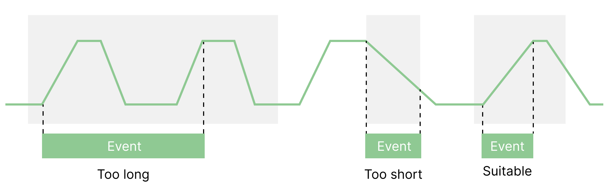
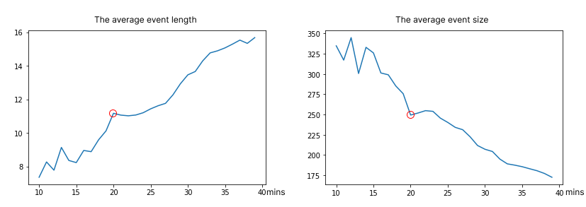
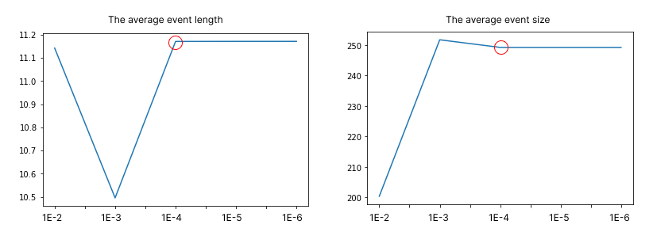
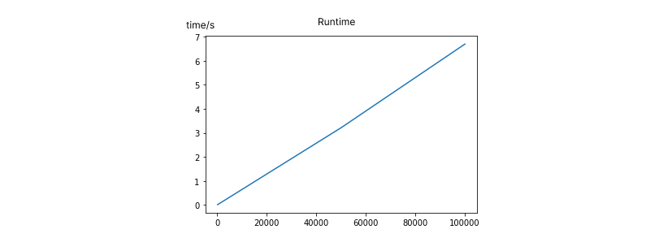

# ECoalVis

We will upload code on Github after patent application.

## Menu

[TOC]

## 1 Data Configuration

You need to prepare three .csv data files and put them into the data folder. 

For each file, we listed the necessary attributes.

We also give an example in *./example_data.* 

### 1.1 example_config.csv

This file contains the structure data of the sensors. It has 10 necessary attributes. 

| Columns      | Type            | Valid Value                                                  | Description                                          |
| ------------ | --------------- | ------------------------------------------------------------ | ---------------------------------------------------- |
| index        | Number          |                                                              | The index of the sensor.                             |
| chn          | String          |                                                              | The name of the sensor.                              |
| action_value | Number          | [0,1,2]                                                      | 0: state sensor, 1: control feedback, 2: calculated. |
| type         | Constant String | ['Current', 'Pressure', 'Air Volume', 'Temperature', 'Coal Quantity', 'Flow', 'Other', 'Frequency'] | The type of the sensor.                              |
| x            | Number          |                                                              | The position of the sensor.                          |
| y            | Number          |                                                              | The position of the sensor.                          |
| stage        | Constant String | ['Coal Pulverizing', 'Burning', 'Steam Circulation', 'All']  | The stage of the sensor.                             |
| component    | String          |                                                              | Which component the sensor belongs.                  |
| component_id | Number          |                                                              | Which component the sensor belongs.                  |
| unit         | String          |                                                              | Which unit the sensor belongs.                       |
| unit_id      | Number          |                                                              | Which unit the sensor belongs.                       |
| is_key       | Constant String | ['Efficiency','Safety','Pollution','Not']                    | This indicates whether the sensor is key sensor.     |

### 1.2 example_data.csv

This file contains the sensor time series data. For this file, you need to organize the data into a format similar to the following. 

| index | timestamp   | efficiency | sensor_name1 | sensor_name2 | ...  |
| ----- | ----------- | ---------- | ------------ | ------------ | ---- |
| 0     | timestamp_0 |            | value1_0     | value2_0     | ...  |
| 1     | timestamp_1 |            | value1_1     | value2_1     | ...  |
| ...   | ...         |            | ...          | ...          | ...  |

### 1.3 example_pipeline.csv

| Columns   | Type            | Valid Value | Description                                                  |
| --------- | --------------- | ----------- | ------------------------------------------------------------ |
| link_type | Constant Number | [0,1,2]     | Indicating the pipeline order of components(0), units(1), sensors(2). |
| src_id    | Number          |             | The index of components / units / sensors.                   |
| dst_id    | Number          |             | The index of components / units / sensors.                   |

A link between src_id -> dst_id means the order of the component/unit/sensor corresponding to the src_id index precedes the dst_id index.

## 2 Parameter Setting & Performance Test

### 2.1 Time-Lag-Aware Extraction of Control Strategies

This is the algorithm to extract the control strategies. This algorithm is divided into two parts, forward queries and backward queries. 

#### 2.1.1 Forward Queries

The first step of forward queries is discretizing time series. In this step, we discretize sensor time series into events sequences. This step contains two parameters as follows.

- Jitter Threshold
- Window Size

| paramters        | setting    |
| ---------------- | ---------- |
| Jitter Threshold | 1e-4       |
| Window Size      | 20 minutes |

**A. Sensitivity Test of Discretization**

We first set different window sizes. We used ***the average event length*** and ***the average event size*** to evaluate the sensitivity of the discretization algorithm to the window size and the jitter threshold.

-  Window Size

  We set a range of 10 to 39 testing the robustness of discretization. We found that when the window size increase, the average event length increases and the average event size decreases. 

  If we set a long window size, there will be more than one peak in the window, and the ternary search will find only the maximum of the last peak and the minimum of the first peak. 

  If we set a short window size, some event will last longer than the window. So, there are more events and the event length is short. 

  

		We tested to find a suitable window size and found that 20 minutes is the best.
	
		We can see the inflection point is 20 in both below figures. During the range between 20 and 25, the results are stable. 
	
		However, when the window size is smaller than 20, the length is too short and extremely unstable. When the window size is larger 25, the event size decreases too quick. This is consistent with our previous inference.

| window_size | 10     | 15     | 20     | 25     | 30     | 35     | 39     |
| ----------- | ------ | ------ | ------ | ------ | ------ | ------ | ------ |
| avg_length  | 7.36   | 8.23   | 11.17  | 11.44  | 13.46  | 15.07  | 15.68  |
| avg_size    | 334.67 | 325.93 | 249.25 | 240.14 | 207.03 | 185.52 | 172.47 |

- Jitter Threshold

  We first set the window size to 20 minutes. Then, we enumerated the threshold and test the discretization. We found 1E-4 is a good setting.

  The testing results are shown below. If the jitter threshold is too large, the discretization will ignore some events. 

| parameter                | 1E-2   | 1E-3   | 1E-4   | 1E-5   | 1E-6   |
| ------------------------ | ------ | ------ | ------ | ------ | ------ |
| the average event length | 11.14  | 10.50  | 11.17  | 11.17  | 11.17  |
| the average event size   | 200.38 | 251.74 | 249.25 | 249.24 | 249.24 |

**B. Performance Test of Discretization**

We test the performance of discretization. For every order of magnitude, we ran the discretization 10 times, and calculated the average time.

| The number of time points | 100    | 1000   | 10000 | 50000 | 100000 |
| ------------------------- | ------ | ------ | ----- | ----- | ------ |
| Runtime (s)               | 0.0105 | 0.0670 | 0.645 | 3.214 | 6.698  |

The performance plot is shown below. It seems like a linear complexity. 

We slide the window, so the complexity of enumeration is $O(N)$, where the $N$ means the number of time points.

The complexity of ternary search is $O(log_3W)$, where the $W$ means the window size.

The total complexity is $O(Nlog_3W)$.

As the $log_3W$ is small, we can ignore it.

Therefore, the performance of discretization is nearly linear.

#### 2.1.2 Backward Queries

**The Time Lag Range:** The delay is ranged from **1 to 15** minutes. The search terminates if the search queue is empty or the duration of the control strategy has exceeded **2 hours**.

**Correlation Threshold:** We use the absolute value of  Pearson coefficient to judge the correlation between sensors. This threshold is set to **0.8**. Two sensors whose absolute Pearson coefficient exceeds **0.8** can be regarded as very correlated, and are likely to have a causal or coordinated relationship.

### 2.2 The graph layout algorithm

Inspired by the multi-level force-directed graph algorithm, we adopt a node-link diagram-based design in the relationship-oriented visualization of Graph view. The layout algorithm for this view contains three main parameters as follows.

- Coulomb force coefficient kl
- Hooke coefficient ks
- The maximum number of iterations.

| parameters     | units | sensors |
| -------------- | ----- | ------- |
| kl             | 13    | 15      |
| ks             | 4     | 1       |
| max_iterations | 50    | 50      |

## 3 Data Detail

